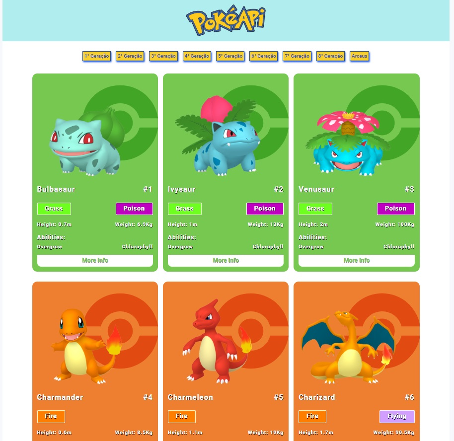

## BOOTCAMP INTER ORANGE TECH + FRONT-END - DIO._(Digital Innovation One)

## 📝 Projeto Construindo uma Pokedex consumindo a POKEAPI
Projeto de construção de uma pokedex utilizando HTML/CSS e javascript consumindo informações de uma API externa.

## 💻 Screenshot do projeto

<h4 align="center"><a href="https://brunooliveira16.github.io/Bootcamp-inter-orange-tech-frontend/DESAFIO-MODULO-01/index.html" target="_blank">Clique aqui e visite o projeto</a></h4>

## 📚 Descrição
Projeto tem como desafio aplicar os conceitos aprendidos nas aulas do módulo de JavaScript, assim como aplicar conceitos de requisição a uma API externa, utilização da função MAP, manipulação de resultados através de uma promise.

## 💼 Tecnologias utilizadas
- HTML;
- CSS;
- JavaScript

## 🙋🏻‍♂️ Autor
Bruno Oliveira
